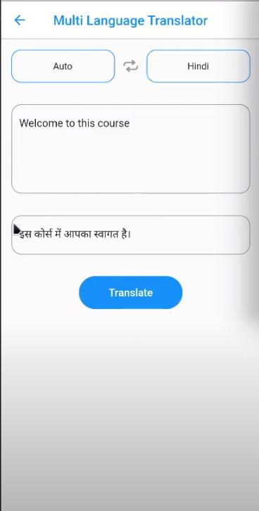

# Ai-Dash

**OpenAI API, Lexica API, Google Translation**

Ai-Dash is a project that leverages AI technologies to create an intelligent chatbot with real-time interaction, image generation, and translation capabilities.

## Project Timeline
**April 2023 – October 2023**

## Features
- **Chatbot:** ChatGPT API for intelligent, real-time interaction.
- **Image Generation:** Integrated Lexica API to generate and search images based on user prompts.
- **Language Translation:** Utilized Google Translation to support translations between all languages.
- **Backend Services:** Developed robust backend for request handling, image generation, customized chatbot responses, and translations.

## Technologies Used
- **OpenAI API (ChatGPT)**
- **Lexica API**
- **Google Translation API**

## Project Screenshots

### Chatbot Interface

### Image Generation Feature

### Translation Feature

## Additional Screenshots

Here are more screenshots showcasing the project:

   
   
   
   
   

## GitHub Repository
[Ai-Dash GitHub Repo](https://github.com/your-username/Ai-Dash)
